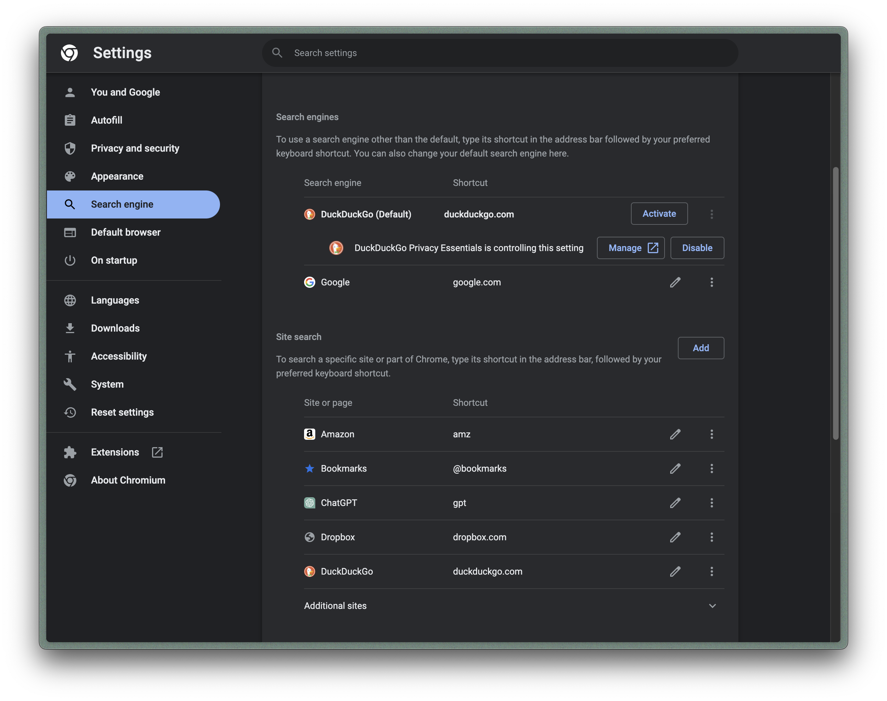

# ChatGPT-In-Arc-Site-Search

Ask a question to ChatGPT directly from Arc's Command Bar (⌘T).

What is Site Search? -> [Site Search: Directly Search any Website](https://resources.arc.net/en/articles/7183263-site-search-directly-search-any-website)

## Usage

### Add `ChatGPT` Site for Site Search

Use `⌘T` to open the command bar on any page, type `Site Search Settings`, then open the `Settings` page, scroll to `Site Search`, click the `Add` button. 

In the `Add search engine`, fill in three items:

**Search engine**

the name displayed in the command bar. e.g. `MyChatGPT`

**Shortcut**

the shortcut command entered in the command bar. e.g. `gpt`

**URL with %s in place of query**

- New conversation: https://chat.openai.com/?q=%s
- Specify a conversation: https://chat.openai.com/c/xxxxxxxx-xxxx-xxxx-xxxx-xxxxxxxxxxxx/?q=%s (By clicking on the specified conversation and then copying the URL)

Any one of the above two options can be chosen.

### Create New Boost

Click `+` in the bottom left corner and click `New Boost`, to create a new Boost.

**Click on `Inject`**

**Click on `A specific website`**

**Enter the url**: https://chat.openai.com, then **Click on `Create Boost`**

### Copy code

Copy the code from `chatgpt-boost.js` in the current project to the `content.js` of the new boost.

## Run

- Use `⌘T` to open the command bar on any page
- type `gpt`, press `Tab`
- type your question, and press `Enter`

Done!